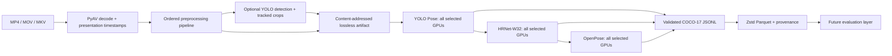

# Thesis experiment architecture

## Data flow



The model arrows describe scheduling, not data dependence: every model reads the same immutable artifact. Models run serially to give each one all selected GPUs and to avoid cross-model memory contention. Within a model, artifact sequence index modulo GPU count assigns frames or crops to independent processes. Their records are schema-validated, checked for duplicate identities, sorted deterministically, and atomically merged.

## Stable contracts

`FramePacket` is the internal image contract. Besides a BGR `uint8` image it carries source-frame index, presentation timestamp, source size, optional crop/track identity, and a 3×3 transform from current pixels back to source-video pixels. Geometric processors compose that transform. Consequently all model outputs can be compared in original-frame coordinates even after resizing, super-resolution, or cropping.

`PredictionRecord` is the external runner contract. It contains exactly 17 COCO keypoints, model/pipeline/experiment/source IDs, timestamps, person/crop/track IDs, source bounding box, inference time, and an explicit `original_frame` coordinate-space tag. OpenPose BODY_25 is mapped to COCO-17; HRNet and YOLO Pose already emit the COCO order.

An external runner receives:

```text
--input-artifact PATH --output-jsonl PATH
--experiment-id ID --pipeline-id ID --model-id ID --source-video-id ID
--batch-size N --shard-index I --shard-count N [--checkpoint PATH]
```

Any new model that implements this command contract can be inserted through YAML without changing the orchestrator.
The special command token `{python}` resolves to the orchestrator's active Python interpreter and is useful for the local mock runner. Real model configurations normally name their isolated environment explicitly.
Input, output, cache, and checkpoint fields are resolved relative to the YAML file. Command elements are executed verbatim from the directory in which the orchestrator was started; the supplied examples assume the repository root.

## Artifacts and recovery

The artifact key is the SHA-256 hash of the source bytes plus the validated preprocessing configuration. Full-frame constant-resolution pipelines use FFV1 in Matroska; crop or variable-resolution pipelines use lossless PNGs in deterministic TAR shards. A JSONL sidecar preserves frame/crop transforms and identity. A completed `artifact.json` is the cache commit marker.

Artifacts and result archives are written to temporary paths and renamed only after completion. Model jobs persist `PENDING → RUNNING → VALIDATING → COMPLETE` or `FAILED`. Interrupted states are recovered as failed and may be rerun. Completed jobs are reused only while their Parquet output exists. A CUDA OOM deletes the incomplete attempt as an eligible result and restarts every shard at half the batch size; logs remain available for diagnosis.

Cold materialization, per-preprocessor compute, model wall time, validation/archive time, cache hits, final batch size, retry count, GPU inventory, package versions, Git commit, and the full validated configuration are recorded in summaries or manifests.

## Adding a preprocessing operation

1. Implement a class with a unique `name` and `process(packet, context)` method in `src/football_pose/preprocessing/`.
2. Return one or more `FramePacket` objects. Use `packet.derived(...)`; pass the current-to-previous 3×3 matrix if geometry changes.
3. Add a factory to `REGISTRY` in `preprocessing/__init__.py`.
4. Add a non-visual test for output shape, `uint8` BGR type, range, non-crashing behavior, and coordinate transformation when applicable.
5. Reference it by name and parameters in YAML.

The registry is intentionally explicit: misspelled steps and unknown parameters fail before an expensive server run.

## Server preparation

The orchestrator needs the core requirements. Each model command needs its isolated dependency set and access to the repository, artifact directory, output directory, and checkpoints. With virtual environments, use the commands shown in `configs/server-three-models.yaml`. With containers, build the supplied Dockerfiles and wrap their entry points with the equivalent bind mounts and `--gpus device=...` selection.

Before a thesis-scale job:

1. Validate YAML and all checkpoint paths.
2. Run the CPU mock configuration against a short real clip.
3. Follow the one-GPU procedure in [server.md](../server.md) to run each real model on a short artifact.
4. Inspect the artifact and archive manifests.
5. Run the full experiment, preserving the YAML, result manifests, Parquet files, and runner logs.

### Shared GPU server policy

Before every GPU command, update the shared semaphore document with your name, the physical GPU IDs reserved, and the expected duration. Check availability with `nvitop` or `nvidia-smi`, then export exactly those physical IDs through `CUDA_VISIBLE_DEVICES`. The YAML `devices` lists must contain the same IDs; the orchestrator rejects any model that requests an ID outside the active reservation. Never select every GPU by default.

Use `/lyra/cache/YOUR_USERNAME/football-pose/` for regenerable artifacts and public model downloads. Keep custom source footage, unique checkpoints, result Parquet files, manifests, and experiment configurations in backed-up project storage. The container wrapper mounts an external input artifact or checkpoint explicitly, without exposing the whole shared filesystem.

The server is for validated scaling, not exploratory debugging. Run unit and CPU contract tests locally first, use the shortest practical one-GPU hardware validation, and only then reserve multiple GPUs for a full experiment. Monitor `nvitop`, system RAM, swap, CPU load, and storage throughout the run. Low GPU utilization with high CPU/RAM or I/O indicates that preprocessing or artifact loading is starving the model.

Jobs are bounded by per-model timeouts, containers terminate after each shard, preprocessing artifacts are atomic, and completed model archives are resumable. Preserve logs and manifests. If a large run fails, diagnose it from the smallest reproducible input rather than repeatedly debugging against the shared GPUs.

Evaluation consumes archives and never needs to rerun inference. Its implementation is deferred until the DFL/Werder annotation taxonomy, image-plane projection, and time synchronization are known.

## Third-party model licensing

The orchestration code in this repository retains its repository license, but model implementations and weights keep their own terms. In particular, OpenPose's upstream license restricts it to academic or non-profit, non-commercial research unless another license is obtained. Confirm the applicable terms before using the server images or distributing model artifacts.
